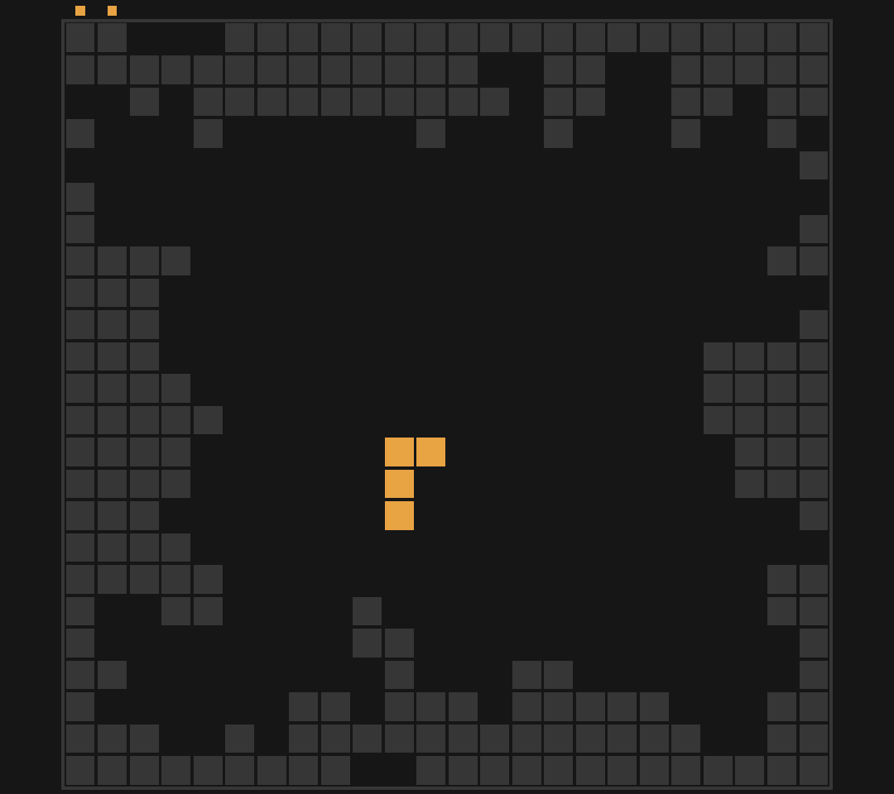
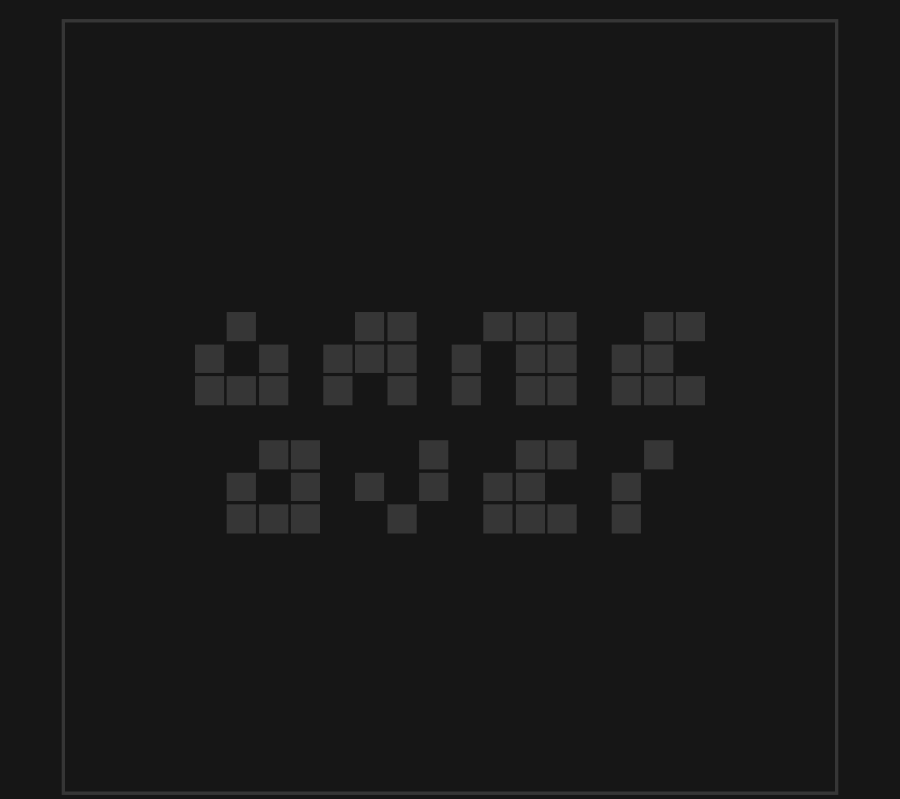

# TetraTetris

Author: Rain Du

Design: Tetris but with a rotatable board, which is essentially 4 tetris games going on at the same time and the user gets to choose which one to continue with the current tile.

Screenshots:

How To Play:

- `left` arrow key: rotate the board counter-clockwise.
- `right` arrow key: rotate the board clockwise.
- `down` arrow key: let the current tile fall to ground immediately.
- `s`: take a screenshot.

This game was built with [NEST](NEST.md).
